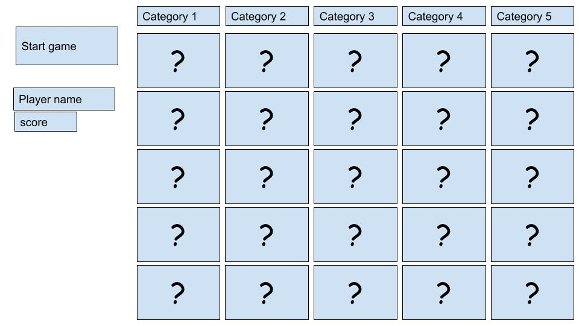
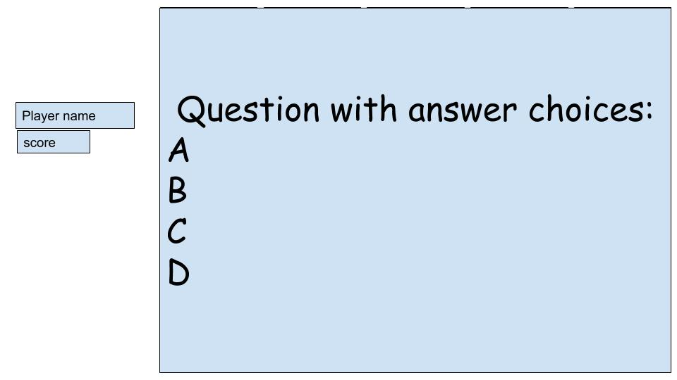
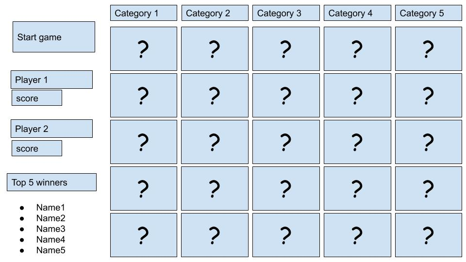
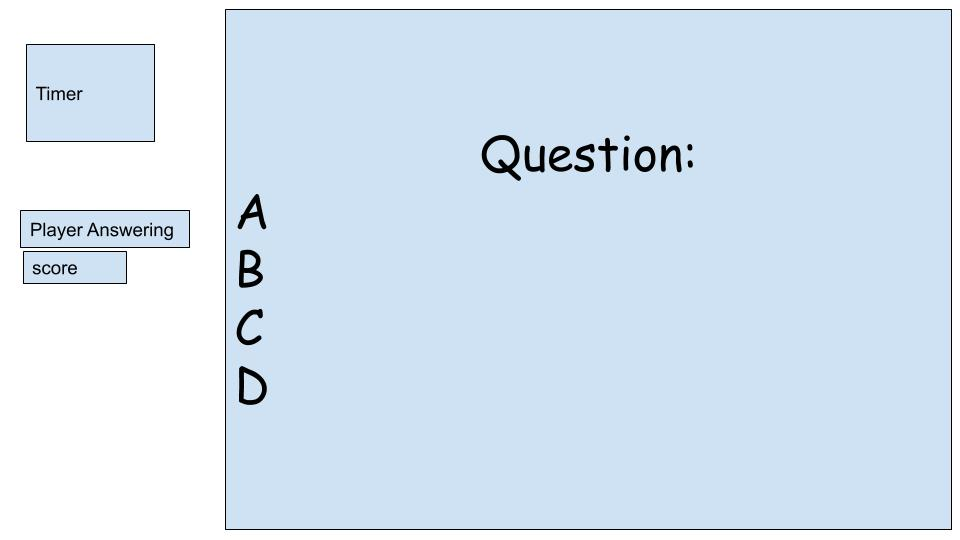

# Project proposal

## Project Choice

Trivia (Self-scoring)

## Project Description

- This will be a Spider-Man trivia game with difficulty levels of questions that allow for varying point levels. The game will allow the player to determine if their Spidey knowledge is at its peak or if they need to go back and read a few storylines in the comics to refresh their memory.
- The trivia game will be similar to jeopardy in that all of the questions will be available on the screen at once hidden by point levels, so the player may choose their questions by challenge/point level. There may be an option to make it a 2-player game so that Spidey fans may challenge others to trivia knowledge.

## Wire Frames

**Initial Landing View**

**Question View**

**Stretch Goals Views**

## User Stories

#### MVP Goals

- As a player, I want my game to tally points received for each correct answer
- As a player, I would like to start the game with a button
- As a player, I would like to see the question in full screen so I can read the question
- As a player, I would like to be informed if the answer chosen is right or wrong
- As a player who requires assistive technologies, I would like accessibility features so that I'm not left out of enjoying the game.
- As a player I would like to be able to restart the game.
- As a player, I would like the answered questions to show up as unclickable and different so I know which questions I have not answered.

#### Stretch Goals

- As a player, I would like to be added to a top 5 list of players with the highest scores.
- As a player, I would like to hear sounds that play when a question is correct or incorrect.
- As a player, I would like to play this game with another player.
- As a player, I would like to play this game online so that I don't have to have my challenger sitting next to me.
- As a player, I would like a varied choice of questions so that I can play the game several times with new questions to answer.
- As a player, I would like a timer on each question so that if I don't answer in a certain amount of time, I get the question wrong
- As a challenger, I would like the opportunity to answer a question that my opponent answered wrong or did not answer in time and earn those points myself.
